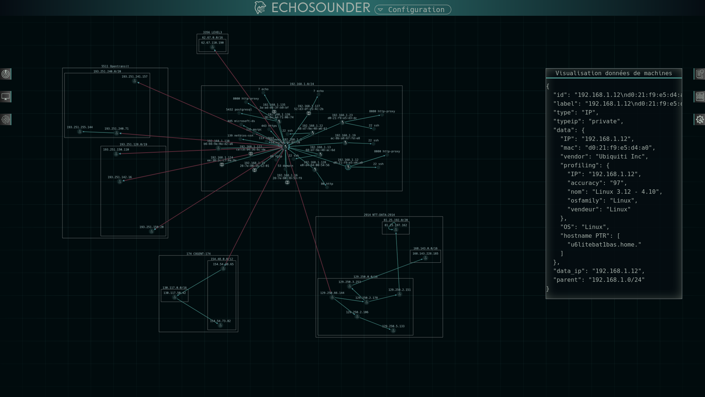
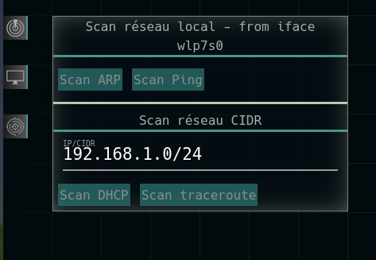
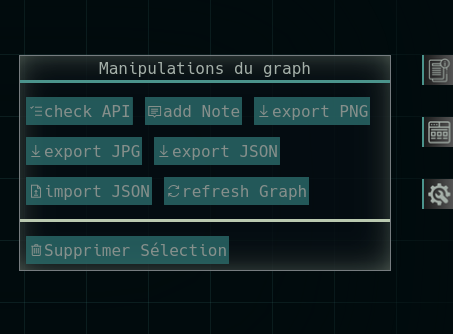
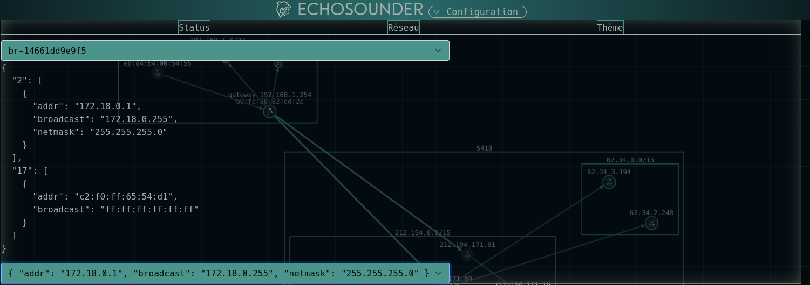

# Echosounder :anchor:

## Présentation 

Echosounder est un explorateur de réseau local proposant une visualisation par graphe.

Le cycle du pentest est généralement composé de 5 phases : 
 - Reconnaissance.
 - Intrusion.
 - Élévation de privilège.
 - Persistence.
 - Exfiltration de données sensibles.

Echosounder se place dans la phase de reconnaissance de ce cycle, en proposant une fois un accès à un réseau privé obtenu, la possibilité de l'explorer, et de sortir une visualisation dudit réseau.

## Screenshots




### Ce que Echosounder permet

 - Effectuer des scans d'un réseau local.
 - Obtenir une vue claire des réseaux locaux & distants liés à ce réseau local.
 - Identifier des machines sur les réseaux.
 - Identifier des services sur ces machines.
 - Avoir l'ensemble des machines et des réseaux affichés sur un graphe.
 - Avoir l'ensemble des données de machines et de réseaux dans un panel "data".
 - Exporter les graphs en JSON.
 - Importer les graphs en JSON.

### Ce que Echosounder n'est pas

 - Un remplaçant à nmap (Echosounder utilise nmap comme dépendance).
 - Un logiciel de "management des asset" (Echosounder ne propose que de la visualisation).
 - Un logiciel de "vulnerability assessement" (Echosounder identifie des services via nmap, mais ne vérifie pas les vulnérabilités).

## Installation

### Dépendances
 
 - nmap (https://nmap.org/)
 - Scapy (https://scapy.net/)
 - Impacket (https://github.com/SecureAuthCorp/impacket)
 - dnspython (https://www.dnspython.org/)

### Installation 

```bash
git clone https://github.com/darcosion/Echosounder
cd Echosounder
sudo apt install nmap
sudo pip3 install -r requirements.txt
# mise à jour de la base de données CIDR -> AS
python3 asinfo/collectas.py
# mise à jour de la base de données MAC -> OUI
python3 ouiinfo/collectoui.py
```
### Lancement 

```bash
sudo ./webchosounder.py
```

## Usage

Echosounder s'utilise à partir de menu déroulants.  
Pour résumer, **le menu de gauche sert aux scans**, **le menu du haut sert aux règlages**, et **le menu de droite fournit les informations et manipule le graph**.  


A partir des boutons de menus de gauche, on accède aux fonctions de scan :  
  
Et les trois boutons initiaux du menu de gauche servent respectivement à afficher :  
 - les scans de réseaux locaux
 - les scans de machines
 - les scans permettant la découverte de réseaux distants
  
A partir des boutons du menu de droite, on accède aux fonctions de manipulation du graph et d'affichage des informations :  
  
Et les trois boutons initiaux du menu de droite servent respectivement à afficher :
 - les info de noeuds
 - les info de services
 - les boutons de manipulation du graph (import, export, resize, note, etc...)


Enfin, le menu du haut permet de configurer l'application : 
  
Et les trois menu fournissent différents informations/config :  
 - information d'état de l'application
 - choix d'interface réseau actuelle
 - choix de thème de l'application